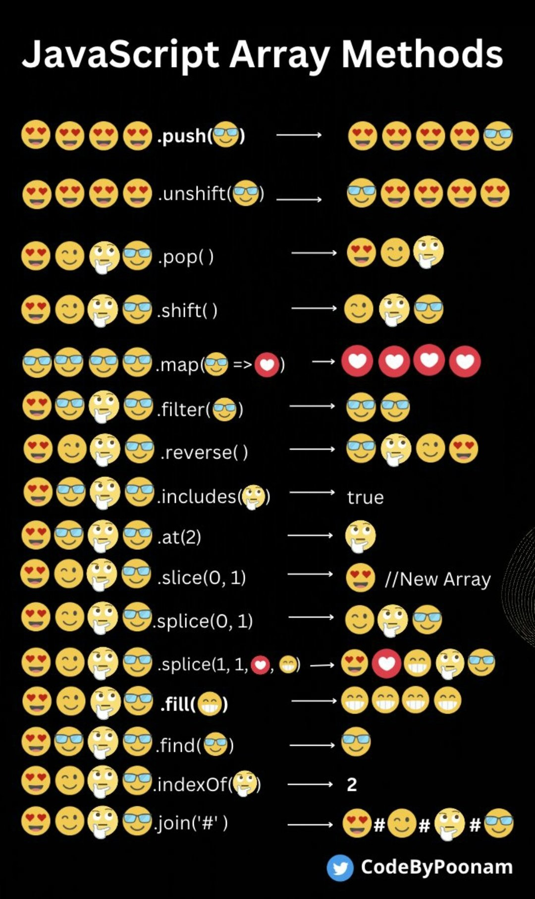

# ARRAY

### Methode split() :

```js
let string = 'HugoLClavinas' //variable type string

let array = string.split('L'); //tableau de 2 valeurs separer par la place du "L"
console.log(array);

array = string.split('') //letres du string divise en tableau par lettre
console.log(array);
```

### Autres methodes :


